# EduManage REST API Documentation & Client Integration Guide

Welcome to the comprehensive API documentation for the **EduManage School Management System**. This guide provides endpoint specifications, request/response contracts, authentication flow, and Flutter client integration instructions.

---

## Architecture Overview

```mermaid
graph LR
    FlutterClient[Flutter App / UI] -->|Riverpod Providers| ApiServices[Type-Safe API Services]
    ApiServices -->|HTTP + JWT| ApiClient[ApiClient]
    ApiClient -->|REST API Requests| ExpressBackend[Express.js Backend :5000]
    ExpressBackend -->|Auth & Query Middleware| Modules[Controllers & Services]
    Modules -->|Atomic Persistence| Store[JSON Document Database]
```



---

## 1. Network & Base URLs

The Flutter client automatically resolves the appropriate backend endpoint based on the execution platform (`ApiEndpoints.baseUrl`):

| Platform | Base URL |
| :--- | :--- |
| **Android Emulator** | `http://10.0.2.2:5000/api/v1` |
| **Web Browser** | `http://localhost:5000/api/v1` |
| **Windows Desktop** | `http://localhost:5000/api/v1` |
| **macOS / iOS Simulator** | `http://localhost:5000/api/v1` |

---

## 2. Authentication Flow

EduManage uses stateless **JWT Bearer Token** authentication. Tokens are persisted on the client using `SharedPreferences` (`edumanage_jwt_auth_token`) and injected into the `Authorization: Bearer <token>` header for all authenticated requests.

### Endpoints:
- `POST /api/v1/auth/login`
  - **Body**: `{ "email": "admin@edumanage.edu", "password": "Password@123" }`
  - **Response**: `{ "success": true, "data": { "token": "...", "user": { ... } } }`
- `POST /api/v1/auth/register`
  - **Body**: `{ "name": "...", "email": "...", "password": "...", "role": "teacher" | "student" | "parent" }`
- `GET /api/v1/auth/me`
  - **Headers**: `Authorization: Bearer <token>`
  - **Response**: Returns authenticated profile.

---

## 3. Query, Pagination, & Search Specifications

Endpoints supporting collections (`/classes`, `/students`, `/teachers`, etc.) accept the following query parameters:

| Parameter | Type | Description |
| :--- | :--- | :--- |
| `search` | `string` | Searches across entity names, roll numbers, subjects, emails, or titles |
| `page` | `number` | 1-indexed page number |
| `limit` | `number` | Number of items per page |
| `sortBy` | `string` | Attribute to sort by (e.g. `name`, `createdAt`) |
| `sortOrder` | `asc \| desc` | Sort direction (default: `asc`) |

### Standard Response Envelope with Pagination
```json
{
  "success": true,
  "count": 10,
  "pagination": {
    "total": 35,
    "page": 1,
    "limit": 10,
    "totalPages": 4
  },
  "data": [ ... ]
}
```

---

## 4. Module Endpoint Reference

### Core Modules
- **Classes**:
  - `GET /api/v1/classes`: List classes (supports `search`, `page`, `limit`)
  - `GET /api/v1/classes/:id`: Get class details
  - `POST /api/v1/classes`: Create class (Admin role required)
  - `PUT /api/v1/classes/:id`: Update class
  - `DELETE /api/v1/classes/:id`: Delete class
- **Students**:
  - `GET /api/v1/students`: List students (supports `class`, `approved`, `search`, `page`, `limit`)
  - `GET /api/v1/students/:id`: Get student details
  - `GET /api/v1/students/parent/:parentId`: List children linked to parent
  - `POST /api/v1/students`: Register student
  - `PUT /api/v1/students/:id`: Update student
  - `DELETE /api/v1/students/:id`: Delete student
- **Teachers**:
  - `GET /api/v1/teachers`: List teachers (supports `approved`, `search`, `page`, `limit`)
  - `GET /api/v1/teachers/:id`: Get teacher details
  - `PUT /api/v1/teachers/:id/approve`: Approve or reject teacher account
  - `PUT /api/v1/teachers/:id`: Update teacher
  - `DELETE /api/v1/teachers/:id`: Delete teacher

### Operations Modules
- **Attendance**:
  - `POST /api/v1/attendance`: Batch save attendance for a class
  - `GET /api/v1/attendance/student/:id`: Get attendance stats and percentage
  - `GET /api/v1/attendance/class/:className/date/:date`: View daily class attendance
- **Assignments**:
  - `GET /api/v1/assignments`: List assignments (filtered by `class` or `teacherId`)
  - `POST /api/v1/assignments`: Create assignment
  - `POST /api/v1/assignments/:id/submissions`: Submit student work
- **Fees**:
  - `GET /api/v1/fees`: List fee records
  - `GET /api/v1/fees/statistics`: Aggregated fee collections and pending amounts
  - `POST /api/v1/fees`: Generate fee invoice
  - `POST /api/v1/fees/:id/pay`: Upload receipt and payment proof
  - `PUT /api/v1/fees/:id/verify`: Admin verification of payment
- **Notices**:
  - `GET /api/v1/notices`: School notice board
  - `POST /api/v1/notices`: Broadcast notice
  - `DELETE /api/v1/notices/:id`: Remove notice
- **Timetable**:
  - `GET /api/v1/timetable`: Class timetable slots
  - `POST /api/v1/timetable`: Add timetable slot
  - `DELETE /api/v1/timetable/:id`: Delete slot
- **Results**:
  - `GET /api/v1/results`: Exam grades list
  - `POST /api/v1/results`: Record student grade
- **Dashboard**:
  - `GET /api/v1/dashboard/admin`: Admin summary counts (students, teachers, classes, pending fees)
  - `GET /api/v1/dashboard/teacher/:teacherId`: Teacher summary metrics
  - `GET /api/v1/dashboard/student/:studentId`: Student summary metrics

---

## 5. Flutter Client Usage Examples

### Using `ApiClient` and API Services Directly
```dart
final authService = AuthApiService();
final result = await authService.login(
  email: 'admin@edumanage.edu',
  password: 'Password@123',
);

if (result.isSuccess) {
  print('Welcome ${result.data?['user']['name']}!');
} else {
  print('Error: ${result.message}');
}
```

### Using Riverpod Reactive Providers
```dart
class ClassListView extends ConsumerWidget {
  @override
  Widget build(BuildContext context, WidgetRef ref) {
    final classesAsync = ref.watch(apiClassesProvider);

    return ApiQueryBuilder<List<ClassModel>>(
      asyncValue: classesAsync,
      onRefresh: () async => ref.invalidate(apiClassesProvider),
      isEmpty: (data) => data.isEmpty,
      emptyTitle: 'No classes found',
      builder: (context, classes) {
        return ListView.builder(
          itemCount: classes.length,
          itemBuilder: (_, i) => ListTile(title: Text(classes[i].name)),
        );
      },
    );
  }
}
```
