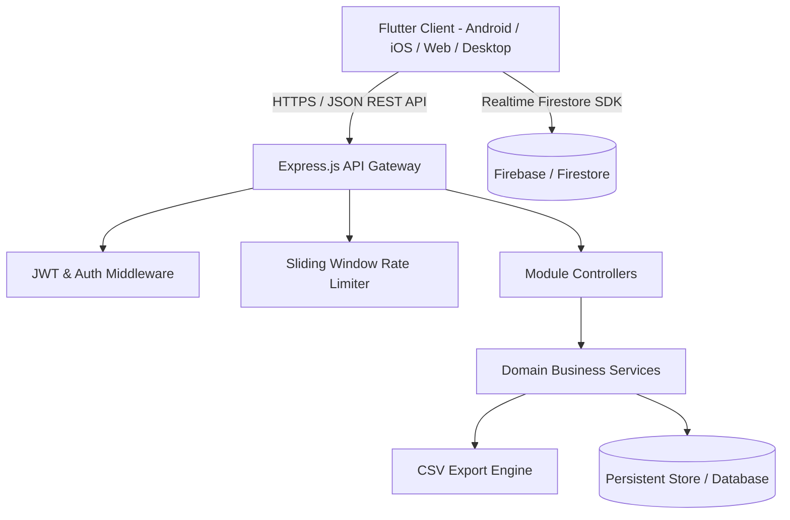

# EduManage System Architecture

This document provides a technical deep-dive into the architectural foundation, data flows, and design principles of the **EduManage** system.

---

## 1. High-Level Architecture

EduManage adopts a layered, client-server design with cross-platform support across mobile, desktop, and web:



---

## 2. Flutter Client Architecture

The frontend is structured around **Feature-First Clean Architecture** and reactive state management powered by **Riverpod**:

```
lib/
├── core/                   # Cross-cutting foundational concerns
│   ├── constants/          # Application string constants and assets
│   ├── router/             # GoRouter navigation definitions and guards
│   ├── theme/              # Material 3 light/dark palettes and typography
│   ├── utils/              # Validators, CsvExporter, DateTimeHelper, DataHelpers
│   └── widgets/            # Design system primitives (AppToast, AppBanner, State widgets)
├── data/                   # Data Access Layer
│   ├── models/             # Domain entities with serialization logic
│   ├── repositories/       # Abstraction layer between API and UI
│   └── services/           # HTTP client and REST endpoint services
└── features/               # Presentation Layer (by domain / role)
    ├── admin/              # Admin dashboard, classes, fee verification, teachers
    ├── auth/               # Login, registration, role selection, splash
    ├── parent/             # Parent view of wards' attendance, fees, results
    ├── student/            # Student portal, homework, timetable, notifications
    └── teacher/            # Teacher portal, attendance entry, grading
```

### State Management Strategy
- **Decoupled Providers**: Repositories and services are exposed via lightweight Riverpod providers (`authRepositoryProvider`, `classesApiServiceProvider`).
- **Reactive UI**: Screens consume `ref.watch()` for real-time reactivity without manual listener subscription lifecycles.
- **Theme Persistence**: `themeModeProvider` manages theme state dynamically across system, light, and dark modes.

---

## 3. Backend REST API Architecture

The backend is built with **Node.js** and **Express.js**, enforcing a modular middleware pipeline:

```
Request 
  │
  ▼
Helmet (Security Headers)
  │
  ▼
CORS & Morgan (Logging)
  │
  ▼
Express Rate Limiter (Brute-force protection)
  │
  ▼
JSON Body Parser
  │
  ▼
JWT Authentication Middleware (authMiddleware)
  │
  ▼
Role & Payload Validation Middleware (validateBody)
  │
  ▼
Route Controller -> Service Layer -> Store
  │
  ▼
Standardized JSON Response Envelope
```

### Key Subsystems
1. **Authentication & Token Management**: Issues signed HMAC-SHA256 JWT tokens with configurable TTL and bearer authentication.
2. **Persistence Store**: Dual support for rapid local prototyping via atomic file-based persistence and cloud synchronization via Firebase Firestore.
3. **Data Export Engine**: Streamlined CSV generation with automated RFC 4180 character escaping and injection attack mitigation.

---

## 4. Security & Hardening Model

- **Formula Injection Mitigation**: All exported CSV cell contents starting with formula characters (`=`, `+`, `-`, `@`, `\t`, `\r`) are sanitized by prepending single quotes (`'`).
- **Rate Limiting**: Sliding window in-memory limiter blocks IP addresses exceeding burst thresholds.
- **Header Hardening**: `helmet` enforces strict HTTP headers including HSTS, X-Content-Type-Options, and CSP protections.
- **Sanitized Inputs**: Centralized validator suite trims and strips control characters from all user payloads before persistence.
