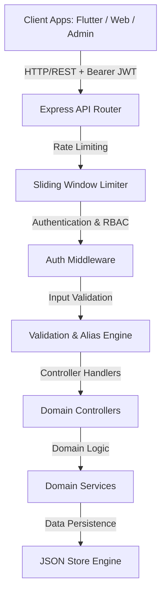

# EduManage Backend Architecture Specification

## Overview

The `edumanage-backend` service provides a scalable, modular RESTful API for the EduManage School Management System. It is engineered with a strict 3-tier Clean Architecture pattern:

## Module Breakdown

1. **Auth & Identity (`src/modules/auth`)**: Stateless JWT token authentication, login, role determination (`admin`, `teacher`, `student`, `parent`), and user profile access.
2. **Academic Classes (`src/modules/classes`)**: Class creation, enrollment capacity tracking, teacher assignment.
3. **Student Directory (`src/modules/students`)**: Student registration, search, class assignment, roll number lookup.
4. **Faculty Management (`src/modules/teachers`)**: Teacher profile management, qualification records, pending approval workflow.
5. **Attendance (`src/modules/attendance`)**: Daily class attendance recording, percentage analytics per student, parameter aliasing (`className` vs `class`).
6. **Assignments (`src/modules/assignments`)**: Assignment creation, deadline tracking, class-specific homework distributions.
7. **Exam Results (`src/modules/results`)**: Grading, marks entry, subject-wise report cards.
8. **Fees & Finance (`src/modules/fees`)**: Invoice creation, payment proof submission, admin verification, and fee analytics.
9. **Notices & Bulletins (`src/modules/notices`)**: School bulletins, emergency notifications, role-targeted announcements.
10. **Timetable & Scheduling (`src/modules/timetable`)**: Class scheduling, period slots, conflict resolution.
11. **Administrative Dashboard (`src/modules/dashboard`)**: Aggregated metrics across students, faculty, revenue, and attendance.
12. **Export Service (`src/modules/export`)**: Streaming CSV exports for student records and financial ledgers.
